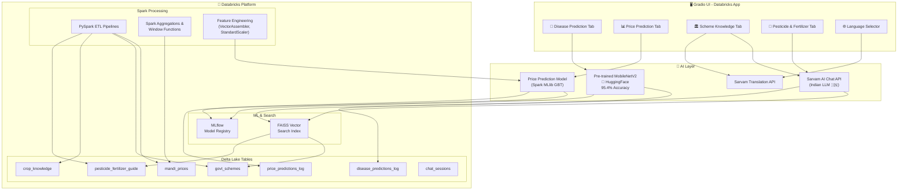

# 🌾 KrishiMitra — AI-Powered Farmer Assistance Platform

> **4 Core Features**: Disease Prediction · Price Prediction · Scheme Knowledge · Pesticide & Fertilizer Use

---

## Architecture Overview



---

## Disease Detection: Pre-Trained Model Choice

> [!IMPORTANT]
> **No training required.** We use a **pre-trained model from HuggingFace** instead of training from scratch. This eliminates the need for GPU clusters and training time.

| Property | Value |
|---|---|
| **Model** | [`linkanjarad/mobilenet_v2_1.0_224-plant-disease-identification`](https://huggingface.co/linkanjarad/mobilenet_v2_1.0_224-plant-disease-identification) |
| **Base** | Google MobileNetV2 (fine-tuned) |
| **Dataset** | PlantVillage — 38 disease classes, 14 crop species |
| **Accuracy** | **95.4%** on evaluation set |
| **Framework** | HuggingFace Transformers (`pipeline("image-classification")`) |
| **Inference** | CPU-only, ~200ms per image |
| **Usage** | 72 Spaces already use this model |

### How it works in our code:
```python
from transformers import pipeline

# One-line inference — no training, no GPU needed
classifier = pipeline("image-classification",
    model="linkanjarad/mobilenet_v2_1.0_224-plant-disease-identification")

results = classifier("leaf_image.jpg")
# → [{"label": "Tomato___Late_blight", "score": 0.94}, ...]
```

---

## Project Structure

```
d:\AIML\databricks\krishimitra\
│
├── app.py                              # Gradio UI entry point (4 tabs)
├── app.yaml                            # Databricks App deployment config
├── requirements.txt                    # All Python dependencies
├── config.py                           # API keys, paths, constants
│
├── notebooks/                          # Databricks Notebooks (run on cluster)
│   ├── 01_data_ingestion.py            # Load raw data → DBFS / local
│   ├── 02_delta_lake_etl.py            # PySpark ETL → Delta Lake tables
│   ├── 03_register_disease_model.py    # Download HF model → register in MLflow
│   ├── 04_price_prediction_model.py    # Spark MLlib price forecasting
│   ├── 05_vector_index_build.py        # Embeddings + FAISS index
│   └── 06_demo_walkthrough.py          # Full demo notebook (judges run this)
│
├── src/                                # Application source code
│   ├── __init__.py
│   ├── disease_predictor.py            # HuggingFace model → disease prediction
│   ├── price_predictor.py              # Commodity → price forecast
│   ├── scheme_advisor.py               # Query → scheme recommendations (RAG)
│   ├── pesticide_advisor.py            # Crop context → pesticide/fertilizer advice (RAG)
│   ├── chat_engine.py                  # Intent routing + conversation manager
│   ├── translator.py                   # Sarvam Translation wrapper
│   └── delta_utils.py                  # Delta Lake read/write helpers
│
├── data/
│   ├── raw/
│   │   ├── mandi_prices.csv            # 50K+ mandi price records
│   │   ├── govt_schemes.json           # 25+ agriculture scheme details
│   │   ├── crop_knowledge.json         # Crop growing + disease treatment KB
│   │   └── pesticide_fertilizer.json   # Pesticide & fertilizer guide
│   └── processed/                      # Auto-generated by ETL
│
└── models/                             # Local model cache + FAISS indexes
    ├── scheme_faiss.index
    └── pesticide_faiss.index
```

---

## Feature 1: 🦠 Crop Disease Prediction (Pre-Trained Model)

### Overview
Upload leaf photo → **HuggingFace MobileNetV2** identifies the disease (38 classes, 95.4% accuracy) → fetches treatment from `crop_knowledge` Delta table → returns diagnosis in farmer's language.

### No Training Needed — Just Download & Register

#### Notebook: `03_register_disease_model.py`
```python
# ============================================================
# Notebook 03: Download Pre-Trained Model & Register in MLflow
# ============================================================
# No GPU needed. No training. Just download and register.

from transformers import pipeline, MobileNetV2ForImageClassification, AutoImageProcessor
import mlflow

# 1. Download pre-trained model from HuggingFace
MODEL_NAME = "linkanjarad/mobilenet_v2_1.0_224-plant-disease-identification"
classifier = pipeline("image-classification", model=MODEL_NAME)

# 2. Test inference on a sample image
test_result = classifier("https://upload.wikimedia.org/wikipedia/commons/thumb/3/32/Tomato_leaf_curl.jpg/220px-Tomato_leaf_curl.jpg")
print(f"Test prediction: {test_result}")

# 3. Register in MLflow for versioning and governance
mlflow.set_experiment("/krishimitra/disease-detection")

with mlflow.start_run(run_name="mobilenetv2_pretrained_plantvillage"):
    mlflow.log_params({
        "model_source": "huggingface",
        "model_name": MODEL_NAME,
        "base_model": "google/mobilenet_v2_1.0_224",
        "dataset": "PlantVillage (38 classes)",
        "reported_accuracy": 0.954,
        "training": "pre-trained (no re-training)",
        "inference_device": "cpu"
    })
    mlflow.log_metric("reported_accuracy", 0.954)

    # Log the transformers pipeline
    mlflow.transformers.log_model(
        transformers_model=classifier,
        artifact_path="disease-classifier",
        registered_model_name="krishimitra-disease-classifier",
        task="image-classification"
    )

print("✅ Model registered in MLflow successfully!")

# 4. Verify: load back from registry and test
loaded = mlflow.transformers.load_model("models:/krishimitra-disease-classifier/latest")
verify_result = loaded("https://upload.wikimedia.org/wikipedia/commons/thumb/3/32/Tomato_leaf_curl.jpg/220px-Tomato_leaf_curl.jpg")
print(f"Verification: {verify_result}")
```

### Disease Classes (38 total)
```
Apple: Apple_scab, Black_rot, Cedar_apple_rust, healthy
Blueberry: healthy
Cherry: Powdery_mildew, healthy
Corn: Cercospora_leaf_spot, Common_rust, Northern_Leaf_Blight, healthy
Grape: Black_rot, Esca, Leaf_blight, healthy
Orange: Haunglongbing
Peach: Bacterial_spot, healthy
Pepper: Bacterial_spot, healthy
Potato: Early_blight, Late_blight, healthy
Raspberry: healthy
Soybean: healthy
Squash: Powdery_mildew
Strawberry: Leaf_scorch, healthy
Tomato: Bacterial_spot, Early_blight, Late_blight, Leaf_Mold,
        Septoria_leaf_spot, Spider_mites, Target_Spot,
        Yellow_Leaf_Curl_Virus, Mosaic_virus, healthy
```

### Delta Lake Table: `disease_predictions_log`

| Column | Type | Description |
|---|---|---|
| `prediction_id` | STRING | UUID for each prediction |
| `timestamp` | TIMESTAMP | When prediction was made |
| `predicted_disease` | STRING | e.g., "Tomato___Late_blight" |
| `predicted_crop` | STRING | e.g., "Tomato" |
| `confidence` | DOUBLE | Model confidence (0-1) |
| `treatment` | STRING | Recommended treatment from KB |
| `model_version` | STRING | MLflow model version used |
| `user_language` | STRING | User's language |

### Source Module: `disease_predictor.py`

```python
from transformers import pipeline
import mlflow

class DiseasePredictor:
    def __init__(self):
        # Load from MLflow registry (versioned, governed)
        # Fallback: load directly from HuggingFace
        try:
            self.classifier = mlflow.transformers.load_model(
                "models:/krishimitra-disease-classifier/latest"
            )
        except:
            self.classifier = pipeline("image-classification",
                model="linkanjarad/mobilenet_v2_1.0_224-plant-disease-identification")

        # Treatment knowledge base (loaded from Delta/JSON)
        self.treatments = self._load_treatments()

    def predict(self, image_path: str) -> dict:
        """
        Args: image_path — path to uploaded leaf image
        Returns: {
            "disease": "Tomato___Late_blight",
            "crop": "Tomato",
            "confidence": 0.94,
            "is_healthy": False,
            "treatment": "Apply copper-based fungicide...",
            "prevention": "Ensure proper spacing between plants...",
            "organic_option": "Bordeaux mixture spray..."
        }
        """
        # Run HuggingFace pipeline
        results = self.classifier(image_path)
        top = results[0]

        disease_label = top["label"]  # e.g., "Tomato___Late_blight"
        crop = disease_label.split("___")[0]
        disease = disease_label.split("___")[1] if "___" in disease_label else "Unknown"
        is_healthy = "healthy" in disease.lower()

        # Fetch treatment from knowledge base
        treatment_info = self.treatments.get(disease_label, {})

        return {
            "disease": disease.replace("_", " "),
            "disease_raw": disease_label,
            "crop": crop,
            "confidence": round(top["score"], 4),
            "is_healthy": is_healthy,
            "treatment": treatment_info.get("treatment", "Consult a local agriculture expert."),
            "prevention": treatment_info.get("prevention", ""),
            "organic_option": treatment_info.get("organic", "")
        }

    def _load_treatments(self) -> dict:
        """Load disease treatment mapping from crop_knowledge"""
        # This maps each of the 38 classes to treatment info
        # Loaded from crop_knowledge.json or Delta table
        ...
```

### Gradio UI Tab
```python
with gr.Tab("🦠 Disease Prediction"):
    gr.Markdown("### 📸 Upload a leaf photo to detect crop disease")
    gr.Markdown("*Supports 14 crops and 38 disease types • 95.4% accuracy*")
    with gr.Row():
        with gr.Column(scale=1):
            image_input = gr.Image(type="filepath", label="Upload Leaf Image",
                                   height=300)
            detect_btn = gr.Button("🔍 Detect Disease", variant="primary", size="lg")
        with gr.Column(scale=1):
            disease_output = gr.Textbox(label="🏷️ Detected Disease")
            crop_output = gr.Textbox(label="🌱 Crop Identified")
            confidence_output = gr.Number(label="📊 Confidence", precision=2)
            health_status = gr.Textbox(label="✅ Health Status")
    treatment_output = gr.Markdown(label="💊 Treatment & Prevention")
    gr.Examples(
        examples=["data/samples/tomato_blight.jpg", "data/samples/healthy_leaf.jpg"],
        inputs=image_input
    )
```

---

## Feature 2: 📊 Mandi Price Prediction

### Overview
Farmer selects a commodity and market → sees current prices, historical trends (Plotly charts), and a **price forecast** for the next 7-30 days using **Spark MLlib** GBTRegressor.

### Data Source
- **AGMARKNET / data.gov.in** — Daily wholesale commodity prices
- **Kaggle fallback**: Pre-downloaded CSV with 50,000+ records

### Delta Lake Table: `mandi_prices`

| Column | Type | Description |
|---|---|---|
| `price_id` | STRING | Unique row ID |
| `arrival_date` | DATE | Date of price recording |
| `state` | STRING | State name |
| `district` | STRING | District name |
| `market` | STRING | Mandi name |
| `commodity` | STRING | Crop/commodity name |
| `variety` | STRING | Variety/grade |
| `min_price` | DOUBLE | Min price (₹/quintal) |
| `max_price` | DOUBLE | Max price (₹/quintal) |
| `modal_price` | DOUBLE | Most common price (₹/quintal) |
| `year` | INT | Extracted year |
| `month` | INT | Extracted month |
| `day_of_week` | INT | Day of week (0=Mon) |
| `moving_avg_7d` | DOUBLE | 7-day moving average |
| `moving_avg_30d` | DOUBLE | 30-day moving average |
| `price_change_pct` | DOUBLE | % change from previous day |

### Notebook: `02_delta_lake_etl.py` — Price ETL (PySpark)

```python
# ============================================================
# PySpark ETL: Raw CSV → Cleaned, Enriched Delta Lake Table
# ============================================================
from pyspark.sql.functions import *
from pyspark.sql.window import Window

# 1. Read raw mandi CSV
raw_df = spark.read.csv("data/raw/mandi_prices.csv", header=True, inferSchema=True)
print(f"Raw records: {raw_df.count()}")

# 2. Clean & Transform
cleaned_df = (raw_df
    .withColumn("arrival_date", to_date("Arrival_Date", "dd/MM/yyyy"))
    .withColumnRenamed("State", "state")
    .withColumnRenamed("District", "district")
    .withColumnRenamed("Market", "market")
    .withColumnRenamed("Commodity", "commodity")
    .withColumnRenamed("Variety", "variety")
    .withColumnRenamed("Min_Price", "min_price")
    .withColumnRenamed("Max_Price", "max_price")
    .withColumnRenamed("Modal_Price", "modal_price")
    .withColumn("year", year("arrival_date"))
    .withColumn("month", month("arrival_date"))
    .withColumn("day_of_week", dayofweek("arrival_date"))
    .filter(col("modal_price").isNotNull() & (col("modal_price") > 0))
    .dropDuplicates(["arrival_date", "market", "commodity", "variety"])
)

# 3. Spark Window Functions — Price Analytics
price_window = Window.partitionBy("commodity", "market").orderBy("arrival_date")

enriched_df = (cleaned_df
    .withColumn("prev_price", lag("modal_price", 1).over(price_window))
    .withColumn("price_change_pct",
        when(col("prev_price").isNotNull(),
            round(((col("modal_price") - col("prev_price")) / col("prev_price") * 100), 2)
        ).otherwise(0.0))
    .withColumn("moving_avg_7d",
        round(avg("modal_price").over(price_window.rowsBetween(-6, 0)), 2))
    .withColumn("moving_avg_30d",
        round(avg("modal_price").over(price_window.rowsBetween(-29, 0)), 2))
    .withColumn("price_id", expr("uuid()"))
    .drop("prev_price")
)

# 4. Write to Delta Lake
enriched_df.write.format("delta") \
    .mode("overwrite") \
    .option("overwriteSchema", "true") \
    .saveAsTable("krishimitra.mandi_prices")

# 5. Enable Change Data Feed
spark.sql("""ALTER TABLE krishimitra.mandi_prices
             SET TBLPROPERTIES (delta.enableChangeDataFeed = true)""")

# 6. Summary stats
spark.sql("""
    SELECT commodity,
           COUNT(*) as records,
           ROUND(AVG(modal_price), 2) as avg_price,
           MIN(arrival_date) as earliest,
           MAX(arrival_date) as latest
    FROM krishimitra.mandi_prices
    GROUP BY commodity
    ORDER BY records DESC
    LIMIT 20
""").display()
```

### Notebook: `04_price_prediction_model.py` (Spark MLlib)

```python
# ============================================================
# Spark MLlib Pipeline: Price Prediction with GBTRegressor
# ============================================================
from pyspark.ml import Pipeline
from pyspark.ml.feature import VectorAssembler, StandardScaler, StringIndexer
from pyspark.ml.regression import GBTRegressor
from pyspark.ml.evaluation import RegressionEvaluator
import mlflow, mlflow.spark

# 1. Load from Delta
prices_df = spark.table("krishimitra.mandi_prices") \
    .filter(col("moving_avg_7d").isNotNull()) \
    .filter(col("moving_avg_30d").isNotNull())

# 2. Feature Engineering Pipeline
commodity_indexer = StringIndexer(inputCol="commodity", outputCol="commodity_idx", handleInvalid="keep")
market_indexer = StringIndexer(inputCol="market", outputCol="market_idx", handleInvalid="keep")
state_indexer = StringIndexer(inputCol="state", outputCol="state_idx", handleInvalid="keep")

feature_cols = ["year", "month", "day_of_week", "commodity_idx",
                "market_idx", "state_idx", "moving_avg_7d", "moving_avg_30d"]
assembler = VectorAssembler(inputCols=feature_cols, outputCol="raw_features", handleInvalid="skip")
scaler = StandardScaler(inputCol="raw_features", outputCol="features", withStd=True, withMean=True)

# 3. GBT Regressor
gbt = GBTRegressor(featuresCol="features", labelCol="modal_price",
                   maxIter=50, maxDepth=6, stepSize=0.1, seed=42)

# 4. Full Pipeline
pipeline = Pipeline(stages=[
    commodity_indexer, market_indexer, state_indexer,
    assembler, scaler, gbt
])

# 5. Train/Test Split
train_df, test_df = prices_df.randomSplit([0.8, 0.2], seed=42)

# 6. Train with MLflow
mlflow.set_experiment("/krishimitra/price-prediction")

with mlflow.start_run(run_name="gbt_price_v1"):
    model = pipeline.fit(train_df)

    predictions = model.transform(test_df)
    rmse = RegressionEvaluator(labelCol="modal_price", metricName="rmse").evaluate(predictions)
    mae = RegressionEvaluator(labelCol="modal_price", metricName="mae").evaluate(predictions)
    r2 = RegressionEvaluator(labelCol="modal_price", metricName="r2").evaluate(predictions)

    mlflow.log_params({
        "model": "GBTRegressor", "max_iter": 50, "max_depth": 6,
        "features": str(feature_cols), "train_size": train_df.count()
    })
    mlflow.log_metrics({"rmse": rmse, "mae": mae, "r2": r2})

    mlflow.spark.log_model(model, "price-predictor",
        registered_model_name="krishimitra-price-predictor")

    print(f"✅ RMSE: {rmse:.2f} | MAE: {mae:.2f} | R²: {r2:.4f}")
```

### Source Module: `price_predictor.py`

```python
class PricePredictor:
    def get_current_prices(self, commodity, state=None) -> pd.DataFrame:
        """Query latest prices from Delta table"""
        query = f"""SELECT market, commodity, modal_price, min_price, max_price,
                           arrival_date, price_change_pct
                    FROM krishimitra.mandi_prices
                    WHERE commodity = '{commodity}'
                    {"AND state = '" + state + "'" if state else ""}
                    ORDER BY arrival_date DESC LIMIT 20"""
        return spark.sql(query).toPandas()

    def get_price_trends(self, commodity, market, days=90) -> plotly.Figure:
        """Historical trend chart with moving averages"""
        # SparkSQL → Plotly line chart with 7d/30d MA bands

    def predict_price(self, commodity, market, days_ahead=7) -> list:
        """Load MLflow model → forecast future prices"""
        model = mlflow.spark.load_model("models:/krishimitra-price-predictor/latest")
        # Generate future feature vectors → predict → return

    def get_best_market(self, commodity, state) -> dict:
        """Find highest-paying market"""
        query = f"""SELECT market, ROUND(AVG(modal_price), 2) as avg_price,
                           COUNT(*) as data_points
                    FROM krishimitra.mandi_prices
                    WHERE commodity = '{commodity}' AND state = '{state}'
                    AND arrival_date >= date_sub(current_date(), 30)
                    GROUP BY market ORDER BY avg_price DESC LIMIT 5"""
        return spark.sql(query).toPandas()
```

---

## Feature 3: 🏛️ Government Scheme Knowledge (RAG)

### Overview
Farmer asks about gov schemes in any language → translate to English → FAISS vector search for relevant scheme info → Sarvam AI generates answer → translate back.

### Data: `govt_schemes.json` — 25+ schemes
Each entry contains: `scheme_id`, `name`, `name_en`, `category`, `description`, `eligibility[]`, `benefits`, `how_to_apply`, `documents_required[]`, `official_url`, `helpline`, `coverage`

**Schemes covered**: PM-KISAN, PMFBY, KCC, e-NAM, Soil Health Card, RKVY, PKVY, MIDH, NMSA, Per Drop More Crop, SMAM, National Beekeeping & Honey Mission, PM-KUSUM, ACABC, ATMA, NFSM, and more.

### RAG Pipeline Architecture
```
User Query (Hindi) → Sarvam Translate → English Query
    → FAISS Semantic Search (top-5 chunks from govt_schemes Delta table)
        → Context + Query → Sarvam AI Chat Completion
            → Answer (English) → Sarvam Translate → Hindi Answer
```

### Notebook: `05_vector_index_build.py`
```python
from sentence_transformers import SentenceTransformer
import faiss, numpy as np, json

# 1. Load schemes from Delta table
schemes = spark.table("krishimitra.govt_schemes").toPandas()

# 2. Create text chunks for each scheme
chunks = []
for _, row in schemes.iterrows():
    # Chunk 1: Overview
    chunks.append({
        "scheme_id": row["scheme_id"],
        "text": f"Scheme: {row['name_en']}\nDescription: {row['description']}\nBenefits: {row['benefits']}"
    })
    # Chunk 2: Eligibility & Application
    chunks.append({
        "scheme_id": row["scheme_id"],
        "text": f"Scheme: {row['name_en']}\nEligibility: {row['eligibility']}\nHow to Apply: {row['how_to_apply']}\nDocuments: {row['documents_required']}"
    })

# 3. Generate embeddings
embed_model = SentenceTransformer("all-MiniLM-L6-v2")
embeddings = embed_model.encode([c["text"] for c in chunks])

# 4. Build FAISS index
embeddings_np = np.array(embeddings).astype("float32")
faiss.normalize_L2(embeddings_np)
index = faiss.IndexFlatIP(embeddings_np.shape[1])
index.add(embeddings_np)

faiss.write_index(index, "models/scheme_faiss.index")
# Same process for pesticide_fertilizer → pesticide_faiss.index
```

### Source Module: `scheme_advisor.py`
```python
class SchemeAdvisor:
    def __init__(self):
        self.index = faiss.read_index("models/scheme_faiss.index")
        self.embed_model = SentenceTransformer("all-MiniLM-L6-v2")
        self.chunks = load_chunks()
        self.sarvam = SarvamClient()

    def answer_query(self, query: str, language: str = "en") -> str:
        """Full RAG: translate → search → generate → translate back"""
        en_query = self.translator.translate(query, language, "en") if language != "en" else query

        # Vector search
        q_emb = self.embed_model.encode(en_query).reshape(1, -1).astype("float32")
        faiss.normalize_L2(q_emb)
        scores, indices = self.index.search(q_emb, 5)
        context = "\n\n".join([self.chunks[i]["text"] for i in indices[0]])

        # Generate via Sarvam AI
        prompt = f"""You are KrishiMitra, an expert agricultural advisor.
Answer the farmer's question based on this scheme information:

{context}

Question: {en_query}
Provide specific details including amounts, eligibility, and application steps."""

        response = self.sarvam.chat(prompt)
        return self.translator.translate(response, "en", language) if language != "en" else response
```

---

## Feature 4: 🧪 Pesticide & Fertilizer Advisory (RAG)

### Overview
Farmer selects crop + growth stage + describes problem → RAG retrieves relevant pesticide/fertilizer info → Sarvam AI generates specific recommendation with dosage, method, timing, and organic alternatives.

### Data: `pesticide_fertilizer.json` — 200+ entries
Each entry: `crop`, `growth_stage`, `category` (fertilizer/pesticide/herbicide), `problem`, `product_name`, `dosage`, `application_method`, `timing`, `precautions`, `organic_alternative`, `cost_estimate`

### Source Module: `pesticide_advisor.py`
```python
class PesticideAdvisor:
    def __init__(self):
        self.index = faiss.read_index("models/pesticide_faiss.index")
        self.embed_model = SentenceTransformer("all-MiniLM-L6-v2")
        self.chunks = load_pesticide_chunks()
        self.sarvam = SarvamClient()

    def get_recommendation(self, crop, stage, problem, prefer_organic=False, language="en"):
        """RAG-based recommendation with organic toggle"""
        query = f"{crop} {stage} {problem}"
        # Vector search → Sarvam AI → translate
        # Returns: product, dosage, method, timing, precautions, organic alternative, cost
```

---

## Cross-Cutting Modules

### `config.py`
```python
SARVAM_API_KEY = os.getenv("SARVAM_API_KEY", "")
SARVAM_BASE_URL = "https://api.sarvam.ai/v1"
SARVAM_CHAT_MODEL = "sarvam-m"
DISEASE_MODEL_HF = "linkanjarad/mobilenet_v2_1.0_224-plant-disease-identification"

LANGUAGES = {
    "English": "en", "हिन्दी (Hindi)": "hi", "தமிழ் (Tamil)": "ta",
    "తెలుగు (Telugu)": "te", "ಕನ್ನಡ (Kannada)": "kn", "മലയാളം (Malayalam)": "ml",
    "मराठी (Marathi)": "mr", "বাংলা (Bengali)": "bn", "ગુજરાતી (Gujarati)": "gu",
    "ਪੰਜਾਬੀ (Punjabi)": "pa", "ଓଡ଼ିଆ (Odia)": "or"
}
```

### `translator.py` — Sarvam Translation API wrapper
### `chat_engine.py` — Intent classifier + router to 4 modules
### `delta_utils.py` — Delta Lake helpers (read/write/merge/log)

### `requirements.txt`
```
gradio>=4.0.0
pyspark>=3.5.0
delta-spark>=3.0.0
transformers>=4.30.0          # HuggingFace (disease model)
torch>=2.0.0
mlflow>=2.10.0
faiss-cpu>=1.7.4
sentence-transformers>=2.2.0
sarvamai>=0.1.0
pandas>=2.0.0
numpy>=1.24.0
plotly>=5.18.0
Pillow>=10.0.0
requests>=2.31.0
python-dotenv>=1.0.0
```

---

## Databricks Usage Scorecard (30% weight)

| Feature | How Used | Depth |
|---|---|---|
| **Delta Lake** | 7 tables with CDF, time-travel, MERGE upserts, schema enforcement | ⭐⭐⭐ |
| **PySpark ETL** | Full pipeline: clean → transform → window functions → aggregations | ⭐⭐⭐ |
| **Spark MLlib** | Pipeline: StringIndexer → VectorAssembler → StandardScaler → GBTRegressor | ⭐⭐⭐ |
| **MLflow** | Register pre-trained HF model + price model. Versioning. Metric logging. | ⭐⭐⭐ |
| **FAISS / Vector Search** | Semantic retrieval for scheme + pesticide RAG | ⭐⭐ |
| **Databricks Apps / Notebook** | Gradio UI deployed as app or run in notebook | ⭐⭐ |

---

## Execution Order

| # | Phase | Files | Time |
|---|---|---|---|
| 1 | **Project Setup** | `config.py`, `requirements.txt`, `app.yaml`, `src/__init__.py` | 10 min |
| 2 | **Data Files** | `govt_schemes.json`, `crop_knowledge.json`, `pesticide_fertilizer.json`, `mandi_prices.csv` | 40 min |
| 3 | **Delta Lake ETL** | `01_data_ingestion.py`, `02_delta_lake_etl.py`, `delta_utils.py` | 25 min |
| 4 | **Disease Prediction** | `03_register_disease_model.py`, `disease_predictor.py` | 20 min |
| 5 | **Price Prediction** | `04_price_prediction_model.py`, `price_predictor.py` | 25 min |
| 6 | **RAG Setup** | `05_vector_index_build.py`, `scheme_advisor.py`, `pesticide_advisor.py` | 25 min |
| 7 | **Chat + Translation** | `chat_engine.py`, `translator.py` | 15 min |
| 8 | **Gradio UI** | `app.py` (4 tabs) | 40 min |
| 9 | **Demo Notebook** | `06_demo_walkthrough.py` | 15 min |
| | **Total** | **~20 files** | **~3.5 hrs** |

---

## Verification Plan

### In Demo Notebook (`06_demo_walkthrough.py`)
1. ✅ All 7 Delta tables exist with correct schemas
2. ✅ Disease model loads from MLflow and classifies a sample image correctly
3. ✅ Price prediction model R² > 0.7
4. ✅ RAG returns relevant PM-KISAN info for Hindi query
5. ✅ Pesticide advice returns dosage for Rice/Tillering stage
6. ✅ Price trend chart renders for Wheat in Delhi

### 5-Minute Demo Script
| Time | What to Show |
|---|---|
| **0:00-1:00** | Architecture slide + Delta Lake tables (`DESCRIBE`, time-travel query) |
| **1:00-2:00** | Upload leaf image → Disease detected → Treatment shown in Hindi |
| **2:00-3:00** | Select Rice in Maharashtra → Price trend chart → 7-day forecast |
| **3:00-4:00** | Ask "PM-KISAN का लाभ कैसे मिलेगा?" → Detailed Hindi answer |
| **4:00-5:00** | Wheat/Sowing → Fertilizer recommendation + organic alternative |
